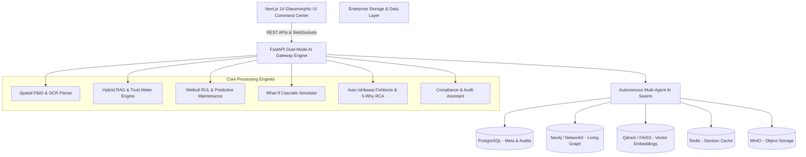
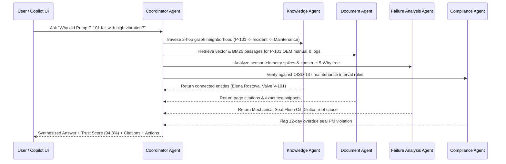

# INDUSTRIAL BRAIN: Industrial Knowledge Intelligence — Unified Asset & Operations Brain

> **An Enterprise AI Operating System for Industrial Knowledge Intelligence, Physical Asset Digital Twinning, Living Knowledge Graphs, Hybrid RAG, Multi-Agent Swarms, and Predictive Maintenance.**

---

## 1. Executive Summary

Modern industrial operations—such as oil refineries, chemical processing plants, thermal power stations, and manufacturing facilities—face severe operational risks due to fragmented, unstructured data. Critical knowledge remains locked inside thousands of engineering Piping & Instrumentation Diagrams (P&IDs), OEM operating manuals, sensor telemetry logs, maintenance work orders, and safety regulatory standards.

**INDUSTRIAL BRAIN** ("The Unified Asset & Operations Brain") is an enterprise-grade AI Operating System designed to break down these data silos. It combines **Universal Document Intelligence**, **Spatial P&ID Drawing Parsers**, **Living Knowledge Graphs**, **Hybrid Vector + BM25 + Graph RAG**, and an **Autonomous 7-Agent Swarm** into a single glassmorphic Command Center UI.

---

## 2. Problem Statement

Industrial facilities operate under high complexity, strict safety regulations, and continuous pressure to prevent unscheduled downtime:

- **Data Fragmentation:** Critical plant documents (PDFs, scanned engineering P&IDs, CSV logs, Word documents) are scattered across disparate legacy systems and file servers.
- **Diagnostic Delays:** When a critical alarm fires (e.g. Pump P-101 vibration exceeding limits), engineers spend hours or days manually locating manuals, past incident logs, and maintenance histories to find the root cause.
- **Institutional Knowledge Loss:** Decades of operational wisdom held by senior field engineers are lost upon retirement without automated capture into structured plant memory.
- **Compliance & Safety Audit Overhead:** Verifying adherence to standards such as OISD-137, ISO 55001, PESO, and Factory Acts requires manual, error-prone audits.
- **Unpredicted Cascade Failures:** A single component failure (e.g. Valve V-101 actuator friction) can cause domino-effect trips across connected downstream process loops.

---

## 3. System Architecture & Diagrams

### High-Level System Architecture



### Modular Block Architecture

```
┌─────────────────────────────────────────────────────────────────────────┐
│               NEXT.JS 14 MODERN ENTERPRISE UI COMMAND CENTER            │
│  Dashboard | P&ID Viewer | Graph Visualizer | Copilot | Digital Twin   │
└────────────────────────────────────┬────────────────────────────────────┘
                                     │ REST APIs & WebSockets
┌────────────────────────────────────▼────────────────────────────────────┐
│                 FASTAPI DUAL-MODE AI GATEWAY ENGINE                     │
│     Routing | Authentication | Document Ingestion | Workflow Engine     │
└───────┬────────────────────────────┬────────────────────────────┬───────┘
        │                            │                            │
┌───────▼─────────────────┐  ┌───────▼─────────────────┐  ┌───────▼─────────────────┐
│  AUTONOMOUS MULTI-AGENT │  │ LIVING KNOWLEDGE GRAPH  │  │ PREDICTIVE MAINTENANCE  │
│      AI SWARM           │  │      & RAG ENGINE       │  │  & WHAT-IF SIMULATOR    │
│ (Coordinator, Know, Doc,│  │ (Neo4j / NetworkX /     │  │ (Weibull RUL Forecast,  │
│ RCA, Compliance, Audit) │  │  Qdrant / Hybrid BM25)  │  │  Cascade Failure Risk)  │
└───────┬─────────────────┘  └───────┬─────────────────┘  └───────┬─────────────────┘
        │                            │                            │
┌───────┴────────────────────────────┴────────────────────────────┴───────┐
│                      ENTERPRISE STORAGE & DATA LAYER                    │
│   PostgreSQL (Metadata) | Neo4j (Graph) | Qdrant (Vector) | MinIO       │
└─────────────────────────────────────────────────────────────────────────┘
```

---

## 4. Full Technology Stack

| Layer | Technologies & Frameworks | Description / Role |
| :--- | :--- | :--- |
| **Frontend UI** | Next.js 14 (App Router), React 18, TypeScript, Tailwind CSS, Framer Motion, Lucide Icons | Glassmorphic command center dashboard, 2D/3D graph canvases, interactive P&ID viewer. |
| **Backend Gateway** | FastAPI, Python 3.11, Pydantic v2, NetworkX, Uvicorn, AsyncIO | High-throughput asynchronous REST/WebSocket gateway engine. |
| **Knowledge Graph** | Neo4j Enterprise + NetworkX In-Memory Fallback Engine | Multi-hop graph traversal, entity lineage, temporal time travel. |
| **Vector & RAG** | Qdrant Vector DB, SentenceTransformers, BM25 Keyword Search, FAISS | Dense vector retrieval combined with keyword reranking & graph context expansion. |
| **Relational & Cache** | PostgreSQL, Redis | Metadata persistence, audit logging, and fast session state caching. |
| **Object Storage** | MinIO / Local File Storage | Storage for raw engineering drawings, PDFs, DOCX, and sensor CSVs. |
| **Deployment** | Docker, Docker Compose, Pytest | Orchestrated multi-container stack with zero-config local fallback capabilities. |

---

## 5. Multi-Agent Swarm Architecture

The platform uses a collaborative **Autonomous 7-Agent Swarm** operating via parallel AsyncIO consensus:



### Agent Roles:
1. **`CoordinatorAgent`**: Parses intent, delegates sub-tasks to specialized agents, and synthesizes final responses.
2. **`KnowledgeAgent`**: Executes multi-hop graph queries across entity-relationship triples.
3. **`DocumentAgent`**: Performs dense vector search and BM25 snippet extraction from ingested manuals.
4. **`FailureAnalysisAgent`**: Constructs Ishikawa (6M) fishbone diagrams and 5-Why causal trees.
5. **`MaintenanceAgent`**: Computes Weibull degradation curves and Remaining Useful Life (RUL).
6. **`ComplianceAgent`**: Evaluates compliance gaps against OISD-137, ISO 55001, and PESO standards.
7. **`AuditAgent`**: Maintains immutable execution traces and verifiable audit logs.

---

## 6. Key Platform Innovations

1. **Graph Time Travel (Temporal Topology Evolution):**
   - Allows plant managers to drag a time slider from 2021 (commissioning) to 2026 to visually observe how asset relationships, maintenance actions, and risk severity evolved over time.

2. **Dual-Mode Zero-Friction Resilience:**
   - Runs in full enterprise Docker environments or self-contained local in-memory fallback mode (NetworkX + SQLite + FAISS) with zero configuration.

3. **Spatial P&ID Drawing Entity Highlighter:**
   - Automatically extracts equipment tag bounding boxes from CAD/PDF schematics, enabling interactive tag inspection.

4. **Predictive Weibull Degradation & RUL Forecasting:**
   - Projects failure probability curves and remaining operational days based on vibration RMS and sensor telemetry.

5. **What-If Failure Cascade Risk Simulator:**
   - Simulates hypothetical component failures (e.g. Valve V-101 failing closed) and projects domino-effect risks across connected plant loops.

6. **Grounded Citation & Trust Score Meter:**
   - Provides paragraph-level document page citations, exact snippets, and transparent confidence scoring.

---

## 7. How to Run Locally

### Option A: Local Dual-Mode Launch (Without Docker)

#### 1. Start FastAPI Backend:
```bash
cd backend
pip install -r requirements.txt
python -m uvicorn app.main:app --reload --port 8000
```
- Interactive Swagger API Docs available at: `http://localhost:8000/docs`

#### 2. Start Next.js Frontend:
```bash
cd frontend
npm install
npm run dev
```
- Open application in browser at: `http://localhost:3000`

---

### Option B: Full Enterprise Docker Stack Launch

```bash
docker-compose up --build
```
This orchestrates PostgreSQL, Neo4j, Qdrant, Redis, MinIO, FastAPI, and Next.js automatically in unified container networks.

---

## 8. Verification & Test Suite

To verify backend API contracts and agent execution:
```bash
cd backend
pytest tests/
```

- `test_e2e_integration.py`: End-to-end workflow verification.
- `test_agents.py`: Multi-agent swarm consensus validation.
- `test_graph.py`: Knowledge Graph topology & time travel testing.
- `test_predictive.py`: Weibull RUL calculation testing.
