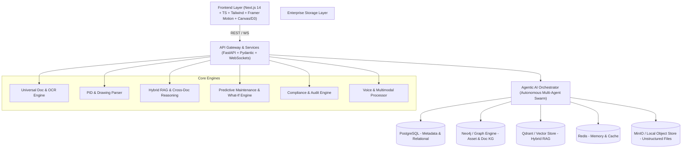

# Implementation Plan: INDUSTRIAL BRAIN - Enterprise Industrial AI Operating System

INDUSTRIAL BRAIN ("The Unified Asset & Operations Intelligence Platform") is an enterprise-grade AI Operating System designed for industrial knowledge intelligence, physical asset digital twinning, hybrid RAG, graph reasoning, agentic workflows, predictive maintenance, compliance, and field operations.

---

## Technical Architecture Overview



---

## Key Architectural Decisions

1. **Dual-Mode Backend Resilience**:
   - Production Docker Stack: Connects to PostgreSQL, Neo4j, Qdrant, Redis, and MinIO.
   - Self-Contained Local Mode: Features automated in-memory / SQLite / NetworkX / FAISS fallbacks so the application, UI, search, knowledge graph, and agentic workflows work 100% out of the box with zero external friction.

2. **Multi-Agentic Swarm Engine**:
   - Autonomous multi-agent pipeline using a Coordinator Agent delegating to specialized agents (Knowledge, Maintenance, Compliance, Failure Analysis, Document, Graph, Audit).

3. **Unified Industrial Knowledge Graph (KG)**:
   - Graph Schema with entities (`Equipment`, `Pump`, `Valve`, `Motor`, `Tank`, `Compressor`, `Engineer`, `Vendor`, `MaintenanceRecord`, `Inspection`, `Manual`, `Incident`, `Failure`, `SafetyProcedure`, `Regulation`, `Location`, `Sensor`) and relationships (`CONNECTED_TO`, `FAILED_DUE_TO`, `MAINTAINED_BY`, `INSPECTED_BY`, `LOCATED_IN`, `USES`, `MENTIONS`, `REFERENCES`, `DERIVED_FROM`, `VISITED_BY`).

4. **20 Core Modules + 20 Hackathon Innovations UI Integration**:
   - Enterprise Dark Glassmorphism aesthetic.
   - Interactive 2D/3D Graph Visualizer, Digital Twin Explorer, Live Risk Radar, Plant Heatmap (Green/Yellow/Orange/Red), Graph Time-Travel timeline, What-If Simulator, Equipment Chatbot, and SOP Generator.

---

## User Review Required

> [!IMPORTANT]
> **Database & AI Service Fallbacks**: The platform will be built fully configured for PostgreSQL, Neo4j, Qdrant, Redis, and OpenAI/Gemini/Claude APIs, while including robust zero-config local mock/in-memory implementations so that all features, charts, graph visualizations, and RAG copilot tools can be run and tested immediately without requiring API keys or running full database containers upfront.

> [!NOTE]
> **P&ID & OCR Document Parser**: We will include an intelligent synthetic computer vision & document parser module for P&ID engineering schematics (detecting tag formats like `P-101`, `V-102`, `C-201`, pressure ratings, flow directions, and connected loops).

---

## Open Questions

- None at present. Proceeding with full enterprise-grade structure.

---

## Proposed Project Structure

```
ET/
├── backend/
│   ├── app/
│   │   ├── api/
│   │   │   ├── endpoints/
│   │   │   │   ├── documents.py
│   │   │   │   ├── graph.py
│   │   │   │   ├── rag.py
│   │   │   │   ├── copilot.py
│   │   │   │   ├── rca.py
│   │   │   │   ├── predictive.py
│   │   │   │   ├── compliance.py
│   │   │   │   ├── digital_twin.py
│   │   │   │   ├── voice.py
│   │   │   │   ├── agents.py
│   │   │   │   ├── innovations.py
│   │   │   │   └── analytics.py
│   │   │   └── router.py
│   │   ├── core/
│   │   │   ├── config.py
│   │   │   ├── security.py
│   │   │   └── database.py
│   │   ├── models/
│   │   │   ├── schemas.py
│   │   │   └── domain.py
│   │   ├── services/
│   │   │   ├── document_processor.py
│   │   │   ├── ocr_engine.py
│   │   │   ├── pid_parser.py
│   │   │   ├── knowledge_graph.py
│   │   │   ├── vector_store.py
│   │   │   ├── RAG_engine.py
│   │   │   ├── agent_swarm.py
│   │   │   ├── predictive_engine.py
│   │   │   └── whatif_simulator.py
│   │   ├── seed_data/
│   │   │   ├── demo_assets.json
│   │   │   ├── demo_incidents.json
│   │   │   └── demo_documents/
│   │   └── main.py
│   ├── requirements.txt
│   └── Dockerfile
├── frontend/
│   ├── src/
│   │   ├── app/
│   │   │   ├── layout.tsx
│   │   │   ├── page.tsx (Executive Command Center Dashboard)
│   │   │   ├── documents/page.tsx (Universal Doc & PDF Viewer)
│   │   │   ├── graph/page.tsx (Natural Language Graph & Time Travel)
│   │   │   ├── copilot/page.tsx (Industrial RAG Copilot & Voice)
│   │   │   ├── digital-twin/page.tsx (Asset Digital Twin & Equipment Chat)
│   │   │   ├── rca/page.tsx (Root Cause Analysis & Fishbone)
│   │   │   ├── predictive/page.tsx (Predictive Maintenance & Risk Heatmap)
│   │   │   ├── compliance/page.tsx (Compliance Intelligence & Audit Assistant)
│   │   │   ├── innovations/page.tsx (What-If Simulator, Memory Graph, Wiki, SOP)
│   │   │   └── admin/page.tsx (Admin & Access Control)
│   │   ├── components/
│   │   │   ├── ui/ (Button, Card, Tabs, Dialog, Badges, Tooltips)
│   │   │   ├── layout/ (Sidebar, Header, StatusBanner)
│   │   │   ├── graph/ (GraphCanvas, TimeTravelSlider, NodeDetailPanel)
│   │   │   ├── twin/ (3DPlantOverview, HeatmapGrid, AssetTree)
│   │   │   ├── copilot/ (ChatStream, VoiceInput, CitationsPanel, TrustMeter)
│   │   │   └── rca/ (FishboneDiagram, FiveWhyTimeline, ActionList)
│   │   ├── lib/
│   │   │   ├── api.ts
│   │   │   ├── types.ts
│   │   │   └── mockData.ts
│   │   └── styles/
│   │       └── globals.css
│   ├── package.json
│   ├── tailwind.config.js
│   ├── tsconfig.json
│   └── Dockerfile
├── docker-compose.yml
└── README.md
```

---

## Detailed Component Plans

### Component 1: FastAPI Enterprise AI Backend (`/backend`)
- **Document Intelligence Engine**: Support for multi-format upload (`PDF`, `DOCX`, `P&ID schematics`, `CSV`, `TXT`, scanned forms). Extracts tags (`P101`, `V101`, `M102`), pressures, temperatures, dates, maintenance logs, and failure codes.
- **Hybrid RAG & Knowledge Graph Engine**: Combined vector similarity (dense embeddings) + keyword search (BM25) + graph context expansion (Neo4j multi-hop query).
- **Multi-Agentic Swarm**: `KnowledgeAgent`, `MaintenanceAgent`, `ComplianceAgent`, `FailureAnalysisAgent`, `DocumentAgent`, `GraphAgent`, `AuditAgent`, and `CoordinatorAgent`.
- **Hackathon Innovation APIs**: What-If Failure Simulator (`/api/innovations/what-if`), Graph Time Travel (`/api/graph/time-travel`), Equipment Chat (`/api/twin/chat`), Auto SOP Generator (`/api/innovations/sop`), and Plant Heatmap Data (`/api/predictive/heatmap`).

### Component 2: Next.js Enterprise Frontend (`/frontend`)
- **Aesthetic**: Deep obsidian glassmorphism dark theme (`#090d16` canvas, neon cyan `#00f2fe`, industrial amber `#ff9f43`, emerald `#10b981`, electric purple `#7000ff`).
- **Pages & Modules**:
  1. **Executive Command Center**: Live metrics, RUL alerts, plant risk heatmaps, global activity logs.
  2. **Industrial Copilot & Multimodal Chat**: Rich chat stream with voice input/output, interactive trust meter, confidence badges, source citations, and paragraph-level document deep links.
  3. **Asset Digital Twin & Plant Explorer**: Interactive 3D plant grid, health statuses, live telemetry simulation, OEM manual viewer, and equipment chat.
  4. **Knowledge Graph Explorer & Time Travel**: Dynamic force-directed graph canvas with entity filtering, node inspector, and time-travel timeline slider (2020-2026 evolution).
  5. **Predictive Maintenance & Failure Heatmap**: RUL (Remaining Useful Life) forecasting, risk scoring, maintenance priority calendars, failure probability curves.
  6. **Root Cause Analysis (RCA)**: Interactive Fishbone (Ishikawa) diagram renderer, 5-Why tree, timeline reconstruction, and automated corrective action generator.
  7. **Universal Document Intelligence & Viewer**: Split-pane PDF/P&ID viewer with auto-highlighted entities, tag sidebars, and direct "Ask AI on selection".
  8. **Compliance Intelligence & Audit Assistant**: Regulatory rule compliance tracking (ISO 55001, OISD, PESO, Factory Act), automated audit report generator, violation radar.
  9. **What-If Failure Simulator & Innovation Hub**: Chain-reaction risk simulator, AI memory graph inspector, industrial wiki generator, and expert retirement preservation suite.

### Component 3: Docker & System Deployment (`docker-compose.yml`)
- Orchestrates Next.js, FastAPI, PostgreSQL, Qdrant, Neo4j, Redis, and MinIO into a unified single-command launch (`docker-compose up --build`).

---

## Verification Plan

### Automated Verification
- Verify backend API endpoint contracts using FastAPI's OpenAPI test schema (`python -m pytest` or direct FastAPI test suite).
- Verify Next.js build (`npm run build`).

### Manual Verification
1. **Copilot Query**: Test asking "Why did Pump P101 fail?" and confirm root cause, graph reasoning path, failure timeline, citations, and trust meter output.
2. **Knowledge Graph Time Travel**: Drag time slider to watch graph topology change between 2021 and 2026.
3. **What-If Simulation**: Trigger simulated failure on "Valve V101" and observe real-time predicted cascade risk report.
4. **Document & P&ID Intelligence**: Upload/view sample P&ID schematics and verify extracted tag highlighting (`P101`, `V101`, `T301`).
5. **Asset Digital Twin**: Inspect Pump P101 telemetry, maintenance history, RUL score (74%), and equipment chat capability.
